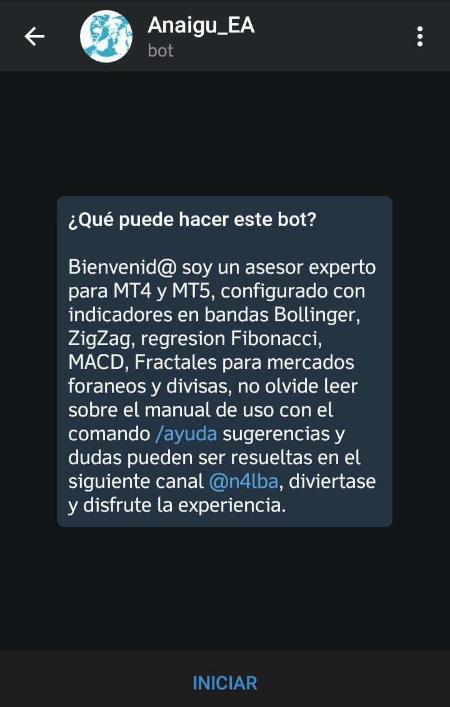
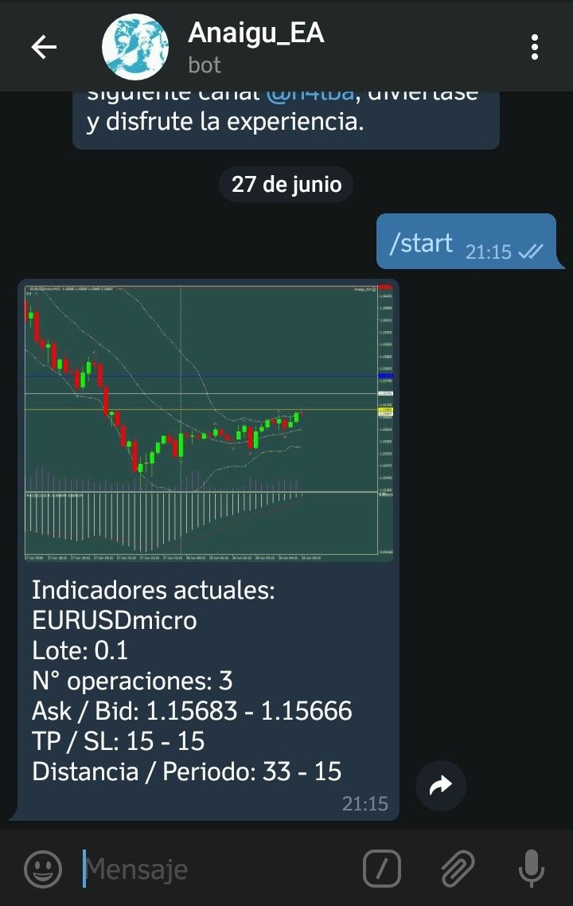
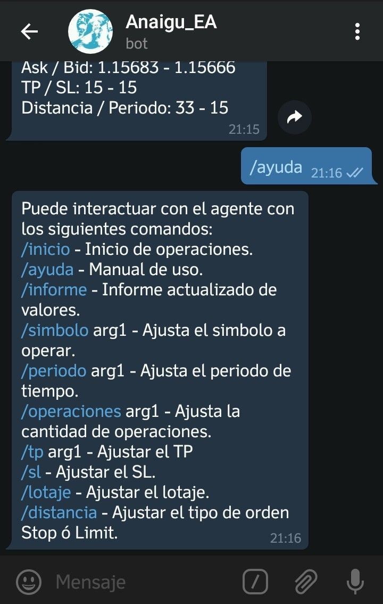
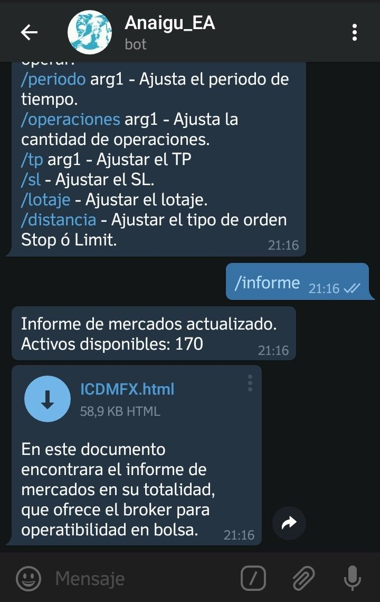
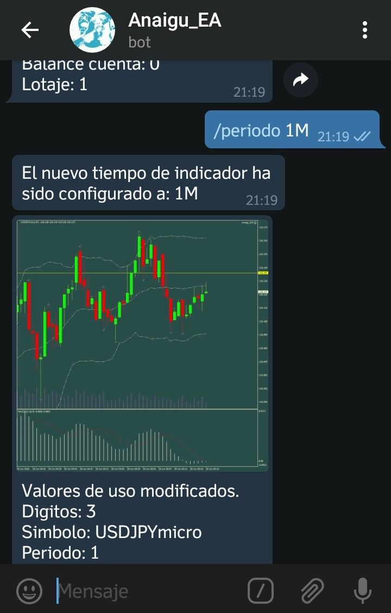

# Anaigu_EA
#Expert advisor for FX on MT4, with an integrated signal system on Telegram.

    Indicators:
    -Bollinger bands
    -Zig Zag
    -MACD
    -Fractal
    -Fibonacci

This expert advisor send the signal tou your chat to track your movement on the account.

Bienvenid@ soy un asesor experto para MT4 y MT5, configurado con indicadores en bandas Bollinger, ZigZag, regresion Fibonacci, Bull, Bear, Fractales para mercados foraneos y divisas, no olvida leer sobre el manual de uso con el comando /ayuda sugerencias y dudas pueden ser resueltas en el siguiente canal @Paixo_bot.

| Indicadores personalizados       | Comados de interaccion           | Informes de mercado              |
| -------------------------------- | -------------------------------- | -------------------------------- |
|   |   |   |
|   |   |   |

    Comando de uso:

    /inicio - Inicio de operaciones.
    /ayuda - Manual de uso.
    /informe - Informe actualizado de valores.
    /simbolo - Ajusta el simbolo a operar.
    /periodo - 1M, 5M, 15M, 30M, 1H, 4H, 1D, 1W, 1MN.
    /operaciones - Cantidad de operaciones a ejecutar.
    /tp - Tomar beneficio Take Profit.
    /sl - Detener perdida Stop Loss.
    /lotaje - Ajustar cantidad del lotaje.
    /distancia - Ajusta el tipo de orden STOP o LIMIT.

    ||||||||||||||||||||||||||||||||||||||||||||||||||||||||||||||||||||||||||||||||||||||||||||||||||||||
    ||||||||||||||||||||||||||||||||||||||||||||||||||||||||||||||||||||||||||||||||||||||||||||||||||||||
    ||||||||||||||||||||||||||||||||||||||||||||||||||||||||||||||||||||||||||||||||||||||||||||||||||||||
    ||||||||||||||||||||||||||||||||||||||||||||||||||||||||||||||||||||||||||||||||||||||||||||||||||||||
    ||||||||||||||||||||||||||||||||||||||||||||||||||||||||||||||||||||||||||||||||||||||||||||||||||||||
    ||||||||||||||||||||||||||||||||||||||||||||||||||||||||||||||||||||||||||||||||||||||||||||||||||||||
    |||||||||||||||||||||||||||||||||||||||||||||||    |||||||||||||||||||||||||||||||||||||||||||||||||||
    ||||||||||||||||||||||||||||||||||||||||||||||/     //\ ||||||||||||||||||||||||||||||||||||||||||||||
    ||||||||||||||||||||||||||\//\ |||||/\|||| \|||/      /// |||||||||||||||||||||||||||||||| \\|||||||||
    |||||||||||||||||||||||||\      //\\   ////// || /      / ||||||||||||||  \\//      |||||/ /||||||||||
    |||||||||||||||||||||||||\      /\\/          /\  /      /|||||||||||\/           /\|||||  \|\\|||||||
    |||||||||||||||||||||||||  \\/  \ \\\/                   /||||||||\/            /\\/\\ ||/  /   / ||||
    ||||||||||||||||||||||||||||||/   \|||/                 /\||||  \/ /////       /\  \////|\         |||
    |||||||||||||||||||||||// ||||/   / ||  \              \|||||| \\|||||||   \\///   / \/ /         /|||
    ||||||||||||||||||||||||| \///      \||||/            /||||||||||||||||||||||| /         \/       /|||
    |||||||||||||||||||||||||||\/   /\\\/ /\| |   /       /|||||||||||||||||||||||||\/       /\       /|||
    |||||||||||||||||||||||| \ ||\ /||||    | /  /\ /    / ||||||||||||||||||||||||||\        /        |||
    ||||||||||||||||||||||| / / | / |||||  \       /\\\\ |||||||||||||||||||||| |||||/\\ /           \||||
    |||||||||||||||||||||||/    \  |||||    /        \||||||||||||||||||||||||| |||  \\\ /          \|||||
    ||||||||||||||||||||||/ / \  /|||||||           \|||||||||||||||||||  |||||||  ||  //    \     \||||||
    |||||||||||||||||||||     |  ||||||||//        / |||||||||||||||||| /   ||||| \ |\/     \|     |||||||
    |||||||||||||||||||||/     \ ///\|||| \|      /\||||||||||\||||||||| / /\ \||\\//\/     ||  / ||||||||
    ||||||||||||||||||||     //      /\  \||/    /\||||||||| |\|||||||||| /// / |\     // /||| \||||||||||
    ||||||||||||||||||||/     |       \  |||\     \|| \|| //\  ||||||||||||    /       /   /|| |||||||||||
    ||||||||||||||||||||/ /// | /     / /\ ||/  / |  \\\|/\  /|||||||||||||  //\  /        /\/||||||||||||
    |||||||||||||||||||| /||\             /\ |/  \\\\ /\ \\\\ |||||||||||||||| \ \/       \ / \|||||||||||
    |||||||||||||||||||  /\/       \\/\\ / //\\\\ \   //\  \||||||||||||||||||\//       / ||/ \|||||||||||
    |||||||||||||||||||        / |||||||||/ /|||\/      /| ||||||||||||||||| \        / ||||   |||||||||||
    |||||||||||||||||||       \||||||||||||\/||\         ///| ||||\ | /\ |||        / |||||| /\|||||||||||
    |||||||||||||||||||      \|||||||||||||||||\           / ||||//\|| ||||| /    /\|||||||||//|||||||||||
    |||||||||||||||||||       ||||||||||||||||| /           / ||||||||||||||||\ /\||||||||||  /|||||||||||
    ||||||||||||||||||||    \||||||||||||||||||/           \||||||||| |||||||| \|||||||||||| //|||||||||||
    ||||||||||||||||||||/    \|||||||||||||||||/           \||||||||||  |||||\/ |||||||||||||//|||||  ||||
    ||||||||||||||||||||\    /\ ||||||||||||||\            \||||||   /\\ ||\/   ||||||||||||| /\  \/  \|||
    ||||||||||||||||||||        \||/\| |||||||\            \|||||\\\\  \\      \ ||||||||||| // ||\  / |||
    |||||||||||||||||||||/       ///   \|| | \\/           \||||/\ \ \\ |||    /\||||||||||||\/  ||  ||\\\
    |||||||||||||||||||||\      /\  \/   \| | /             |||\ \\/ |||||\  \ \\  |||||||||||// /\|| /   
    ||||||||||||||||||||||/  //\|\  \|/  //||\             \ ||\//\|||||||||// | /|||||||||||| /  \|\     
    ||||||||||||||||||||||   ||    \\|\  \ ||\            /\\|| \|||||||||||\// \/ |||||||||| \   / //   /
    |||||||||||||||||||||| \||/       / \|||                \\\  ||||||||||\ /\   ||||||||||||\   \|||| ||
    ||||||||||||||||||||||/\\/         \||| /           /|| ||\/ |||||||||\ / |||||||||||||||||\/  |||||||
    ||||||||||||||||||||||  |\       / ||\/            /  \||| /  ||||||||\  |||||||||||||||||||  ||||||||
    ||||||||||||||||||||||||||/\ // / || \//          \ |||||| ///| ||||     |||||||||||||||||||||||||||||
    |||||||||||||||||||||||||/ \ ||\ |||\          /\|||||||| /  /\ |||    /\||\||||||||||||||||||||||||||
    |||||||||||||||||||||||||/   /\  || /        / ||||||||\/      \\|||     \|||||||||||||||| |||||||||||
    |||||||||||||||||||||||||/    // ||\/      \ |||||||||/        \\|| /   /  ||||||||||||||| /||||||||||
    |||||||||||||||||||||||||/    \||||\/   /\||||||||||||\        /||||\    /||||||||||||||| //||||||||||
    ||||||||||||||||||||||||   /\ |||| \  / ||||||||||||||\/       /||||\    /|||||||||||||||/  ||||||||||
    ||||||||||||||||||||||||\/\||||||\//\||||||||||||||||\/        \\\//\/    |||||||||||||||\/ ||||||||||
    |||||||||||||||||||||||| ||||||||  ||||||||||||||||||| /      /\//\/   / |||||||||||||||\    |||||||||
    |||||||||||||||||||||||||||||||    |||||||||||||||||||\/         /\ /  \ |||||||||||||||     |||||||||
    ||||||||||||||||||||||||||||| |  |||  |||||||||||||||| \         \\\\/// ||||||||||||||||/   |||||||||
    |||||||||||||||||||||||||| /\ ||||||||||||||||||||||  \/        / \ ||| |||||||||||||||||/  /\\ ||||||
    |||||||||||||||||||||||| / / |||||||||||||||||||||||  |\         |\|||||||||||||||||||||||\     ||||||
    ||||||||||||||||||||| \/  /\ ||||||||||||||||||||||||| /       //| ||||||||||||||||||||||||\/ /|||||||
    ||||||||||||||||||| /         /\ |||||||||||||||||||| /       \   |||||||||||||||||||||||||\/  |||||||
    ||||||||||\||||||\/          /\   ||||||||||||||||||||\       \|| ||||||||||||||||||||||||||\\ |||||||
    |||||||| / ||| /              // ||||||||||||||||||| \/        \\ ||||||||||||||||||||||||||||\\||||||
    | |||||\\ || /               /\ |||||||||||||||||||//            /\\\|||||||||||||||||||||||   |||||||
      ||||||||\/                 \\\\\\ |||||||||||| //                 \|||||||||||||||||||||| \\\\ |||||
    |||||| \                   /\\\\\ ||||||||||| \           \/     /\|||||||||||||||||||||||\/    \||||
    ||||| /                 /   | \ \\/\\/\|||||| \/          /         \|||||||||||||||||||||| //\ \ ||||
    ||| /  /////           \   \ \\\\     //    \\\/                    / ||||||||||||||||||||| // |||||||
    | /     |||           /\  \\ \ \/       ///                         / ||||||||||||||||||||||  /|||||||
    \    // \|||/        /\\\\|    \/\\/                                 \| |||||||||||||||||||||  |||||||
    // \   |||/     //\/     ||| |\/                                   //\|||||||||||||||||||||||||||||
    |||||| / / ||/   /  //\\ || |||   \\/                                /  \   ||\\ |||||||||||||||||||||
    ||||||||\/ \|/  /| /  /|| \ |||||||\                               /\  /||||||\\||||||||||||||||||||||
    ||||||||||| |/  /\   /|||||||||||||| /                           / ||| |||||||||||||||||||||||||||||||
    |||||||||||||\        |||||||||||||||||\/                     /\ |||||||||||||||||||||||||||||||||||||
    |||||||||||||        ||||||||||||||||||||| \\//         //\\ |||||||||||||||||||||||||||||||||||||||||
    ||||||||||||||/   / ||||||||||||||||||||||||||||||||||||||||||||||||||||||||||||||||||||||||||||||||||
    ||||||||||||||\  / |||||||||||||||||||||||||||||||||||||||||||||||||||||||||||||||||||||||||||||||||||
    |||||||||||||||  |||||||||||||||||||||||||||||||||||||||||||||||||||||||||||||||||||||||||||||||||||||
    ||||||||||||||||||||||||||||||||||||||||||||||||||||||||||||||||||||||||||||||||||||||||||||||||||||||
    ||||||||||||||||||||||||||||||||||||||||||||||||||||||||||||||||||||||||||||||||||||||||||||||||||||||
    ||||||||||||||||||||||||||||||||||||||||||||||||||||||||||||||||||||||||||||||||||||||||||||||||||||||
    ||||||||||||||||||||||||||||||||||||||||||||||||||||||||||||||||||||||||||||||||||||||||||||||||||||||
    ||||||||||||||||||||||||||||||||||||||||||||||||||||||||||||||||||||||||||||||||||||||||||||||||||||||
    ||||||||||||||||||||||||||||||||||||||||||||||||||||||||||||||||||||||||||||||||||||||||||||||||||||||
    # Todos los derechos reservados Paixo Signal 2018
