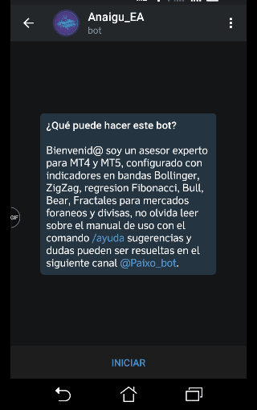
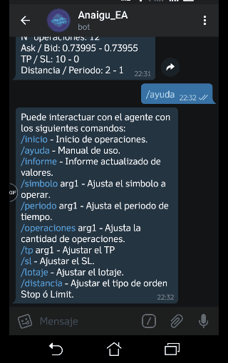
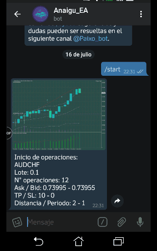
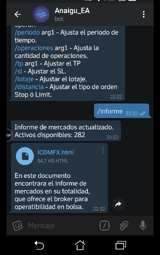

# Anaigu - PaixoSignal :bear:

### English :us:
This initiative aims to generate an automated analysis and operation tool in foreign markets, through the use of linear regression, statistics and mathematics applied to a diffuse logic module, using the Telegram platform as a communication module with the user, it can be configured, monitored, together with the market analysis, this report module is part of an initiative previously carried out by a user in MQL5, we only modify slight components to be analyzed with the indicators and strategy as a whole, the pending operations work with the system of distance for orders to the limit or stop, the doubts that may arise and suggestions please share them within the repository to modify according to the needs of the project, if you want to acquire a license of use for real platform please, contact us. 

Welcome I am an expert advisor for MT4, configured with indicators in Bollinger, ZigZag, Fibonacci regression, MACD, Fractals for foreign markets and currencies, do not forget to read about the manual of use with the command /ayuda suggestions and doubts can be resolved in the following channel @Paixo_bot.

### Spanish :es:
Esta iniciativa tiene como objetivo generar una herramienta de analisis y operacion automatizada en mercados foraneos, por medio del uso de regresion linear, estadistica y matematica aplicada a un modulo de logica difusa, utiliza como modulo de comunicacion con el usuario la plataforma Telegram, puede ser configurado, monitoreado, junto con el analisis de mercado, este modulo de informe es parte de una iniciativa previamente realizada por un usuario en MQL5, solo modificamos ligeros componentes para ser analizados con los indicadores y estrategia en conjunto, las operaciones pendientes funcionan con el sistema de distancia para ordenes al limite o stop, las dudas que puedan surgir y sugerencias por favor compartanlas dentro del repositorio para modificar acorde a las nesecidades del proyecto, si desea adquirir una licencia de uso para plataforma real por favor, contactenos. 

Bienvenid@ soy un asesor experto para MT4 y MT5, configurado con indicadores en bandas Bollinger, ZigZag, regresion Fibonacci, MACD, Fractales para mercados foraneos y divisas, no olvida leer sobre el manual de uso con el comando /ayuda sugerencias y dudas pueden ser resueltas en el siguiente canal @Paixo_bot.

## Indicators / Indicadores :bar_chart:
 * -Bollinger bands
 * -Zig Zag
 * -MACD
 * -Fractal
 * -Fibonacci
 
## Commands / Comando de uso 🤖
   * /inicio - Inicio de operaciones.
   * /ayuda - Manual de uso.
   * /informe - Informe actualizado de valores.
   * /simbolo arg- Ajusta el simbolo a operar.
   * /periodo arg- 1M, 5M, 15M, 30M, 1H, 4H, 1D, 1W, 1MN.
   * /operaciones arg- Cantidad de operaciones a ejecutar.
   * /tp arg - Tomar beneficio Take Profit.
   * /sl arg- Detener perdida Stop Loss.
   * /lotaje arg- Ajustar cantidad del lotaje.
   * /distancia - Ajusta el tipo de orden STOP o LIMIT.  

|           Screenshots            |       Capturas de pantalla       |
| -------------------------------- | -------------------------------- |
|   |   |
|   |   |

    ||||||||||||||||||||||||||||||||||||||||||||||||||||||||||||||||||||||||||||||||||||||||||||||||||||||
    ||||||||||||||||||||||||||||||||||||||||||||||||||||||||||||||||||||||||||||||||||||||||||||||||||||||
    ||||||||||||||||||||||||||||||||||||||||||||||||||||||||||||||||||||||||||||||||||||||||||||||||||||||
    ||||||||||||||||||||||||||||||||||||||||||||||||||||||||||||||||||||||||||||||||||||||||||||||||||||||
    ||||||||||||||||||||||||||||||||||||||||||||||||||||||||||||||||||||||||||||||||||||||||||||||||||||||
    ||||||||||||||||||||||||||||||||||||||||||||||||||||||||||||||||||||||||||||||||||||||||||||||||||||||
    |||||||||||||||||||||||||||||||||||||||||||||||    |||||||||||||||||||||||||||||||||||||||||||||||||||
    ||||||||||||||||||||||||||||||||||||||||||||||/     //\ ||||||||||||||||||||||||||||||||||||||||||||||
    ||||||||||||||||||||||||||\//\ |||||/\|||| \|||/      /// |||||||||||||||||||||||||||||||| \\|||||||||
    |||||||||||||||||||||||||\      //\\   ////// || /      / ||||||||||||||  \\//      |||||/ /||||||||||
    |||||||||||||||||||||||||\      /\\/          /\  /      /|||||||||||\/           /\|||||  \|\\|||||||
    |||||||||||||||||||||||||  \\/  \ \\\/                   /||||||||\/            /\\/\\ ||/  /   / ||||
    ||||||||||||||||||||||||||||||/   \|||/                 /\||||  \/ /////       /\  \////|\         |||
    |||||||||||||||||||||||// ||||/   / ||  \              \|||||| \\|||||||   \\///   / \/ /         /|||
    ||||||||||||||||||||||||| \///      \||||/            /||||||||||||||||||||||| /         \/       /|||
    |||||||||||||||||||||||||||\/   /\\\/ /\| |   /       /|||||||||||||||||||||||||\/       /\       /|||
    |||||||||||||||||||||||| \ ||\ /||||    | /  /\ /    / ||||||||||||||||||||||||||\        /        |||
    ||||||||||||||||||||||| / / | / |||||  \       /\\\\ |||||||||||||||||||||| |||||/\\ /           \||||
    |||||||||||||||||||||||/    \  |||||    /        \||||||||||||||||||||||||| |||  \\\ /          \|||||
    ||||||||||||||||||||||/ / \  /|||||||           \|||||||||||||||||||  |||||||  ||  //    \     \||||||
    |||||||||||||||||||||     |  ||||||||//        / |||||||||||||||||| /   ||||| \ |\/     \|     |||||||
    |||||||||||||||||||||/     \ ///\|||| \|      /\||||||||||\||||||||| / /\ \||\\//\/     ||  / ||||||||
    ||||||||||||||||||||     //      /\  \||/    /\||||||||| |\|||||||||| /// / |\     // /||| \||||||||||
    ||||||||||||||||||||/     |       \  |||\     \|| \|| //\  ||||||||||||    /       /   /|| |||||||||||
    ||||||||||||||||||||/ /// | /     / /\ ||/  / |  \\\|/\  /|||||||||||||  //\  /        /\/||||||||||||
    |||||||||||||||||||| /||\             /\ |/  \\\\ /\ \\\\ |||||||||||||||| \ \/       \ / \|||||||||||
    |||||||||||||||||||  /\/       \\/\\ / //\\\\ \   //\  \||||||||||||||||||\//       / ||/ \|||||||||||
    |||||||||||||||||||        / |||||||||/ /|||\/      /| ||||||||||||||||| \        / ||||   |||||||||||
    |||||||||||||||||||       \||||||||||||\/||\         ///| ||||\ | /\ |||        / |||||| /\|||||||||||
    |||||||||||||||||||      \|||||||||||||||||\           / ||||//\|| ||||| /    /\|||||||||//|||||||||||
    |||||||||||||||||||       ||||||||||||||||| /           / ||||||||||||||||\ /\||||||||||  /|||||||||||
    ||||||||||||||||||||    \||||||||||||||||||/           \||||||||| |||||||| \|||||||||||| //|||||||||||
    ||||||||||||||||||||/    \|||||||||||||||||/           \||||||||||  |||||\/ |||||||||||||//|||||  ||||
    ||||||||||||||||||||\    /\ ||||||||||||||\            \||||||   /\\ ||\/   ||||||||||||| /\  \/  \|||
    ||||||||||||||||||||        \||/\| |||||||\            \|||||\\\\  \\      \ ||||||||||| // ||\  / |||
    |||||||||||||||||||||/       ///   \|| | \\/           \||||/\ \ \\ |||    /\||||||||||||\/  ||  ||\\\
    |||||||||||||||||||||\      /\  \/   \| | /             |||\ \\/ |||||\  \ \\  |||||||||||// /\|| /   
    ||||||||||||||||||||||/  //\|\  \|/  //||\             \ ||\//\|||||||||// | /|||||||||||| /  \|\     
    ||||||||||||||||||||||   ||    \\|\  \ ||\            /\\|| \|||||||||||\// \/ |||||||||| \   / //   /
    |||||||||||||||||||||| \||/       / \|||                \\\  ||||||||||\ /\   ||||||||||||\   \|||| ||
    ||||||||||||||||||||||/\\/         \||| /           /|| ||\/ |||||||||\ / |||||||||||||||||\/  |||||||
    ||||||||||||||||||||||  |\       / ||\/            /  \||| /  ||||||||\  |||||||||||||||||||  ||||||||
    ||||||||||||||||||||||||||/\ // / || \//          \ |||||| ///| ||||     |||||||||||||||||||||||||||||
    |||||||||||||||||||||||||/ \ ||\ |||\          /\|||||||| /  /\ |||    /\||\||||||||||||||||||||||||||
    |||||||||||||||||||||||||/   /\  || /        / ||||||||\/      \\|||     \|||||||||||||||| |||||||||||
    |||||||||||||||||||||||||/    // ||\/      \ |||||||||/        \\|| /   /  ||||||||||||||| /||||||||||
    |||||||||||||||||||||||||/    \||||\/   /\||||||||||||\        /||||\    /||||||||||||||| //||||||||||
    ||||||||||||||||||||||||   /\ |||| \  / ||||||||||||||\/       /||||\    /|||||||||||||||/  ||||||||||
    ||||||||||||||||||||||||\/\||||||\//\||||||||||||||||\/        \\\//\/    |||||||||||||||\/ ||||||||||
    |||||||||||||||||||||||| ||||||||  ||||||||||||||||||| /      /\//\/   / |||||||||||||||\    |||||||||
    |||||||||||||||||||||||||||||||    |||||||||||||||||||\/         /\ /  \ |||||||||||||||     |||||||||
    ||||||||||||||||||||||||||||| |  |||  |||||||||||||||| \         \\\\/// ||||||||||||||||/   |||||||||
    |||||||||||||||||||||||||| /\ ||||||||||||||||||||||  \/        / \ ||| |||||||||||||||||/  /\\ ||||||
    |||||||||||||||||||||||| / / |||||||||||||||||||||||  |\         |\|||||||||||||||||||||||\     ||||||
    ||||||||||||||||||||| \/  /\ ||||||||||||||||||||||||| /       //| ||||||||||||||||||||||||\/ /|||||||
    ||||||||||||||||||| /         /\ |||||||||||||||||||| /       \   |||||||||||||||||||||||||\/  |||||||
    ||||||||||\||||||\/          /\   ||||||||||||||||||||\       \|| ||||||||||||||||||||||||||\\ |||||||
    |||||||| / ||| /              // ||||||||||||||||||| \/        \\ ||||||||||||||||||||||||||||\\||||||
    | |||||\\ || /               /\ |||||||||||||||||||//            /\\\|||||||||||||||||||||||   |||||||
      ||||||||\/                 \\\\\\ |||||||||||| //                 \|||||||||||||||||||||| \\\\ |||||
    |||||| \                   /\\\\\ ||||||||||| \           \/     /\|||||||||||||||||||||||\/    \||||
    ||||| /                 /   | \ \\/\\/\|||||| \/          /         \|||||||||||||||||||||| //\ \ ||||
    ||| /  /////           \   \ \\\\     //    \\\/                    / ||||||||||||||||||||| // |||||||
    | /     |||           /\  \\ \ \/       ///                         / ||||||||||||||||||||||  /|||||||
    \    // \|||/        /\\\\|    \/\\/                                 \| |||||||||||||||||||||  |||||||
    // \   |||/     //\/     ||| |\/                                   //\|||||||||||||||||||||||||||||
    |||||| / / ||/   /  //\\ || |||   \\/                                /  \   ||\\ |||||||||||||||||||||
    ||||||||\/ \|/  /| /  /|| \ |||||||\                               /\  /||||||\\||||||||||||||||||||||
    ||||||||||| |/  /\   /|||||||||||||| /                           / ||| |||||||||||||||||||||||||||||||
    |||||||||||||\        |||||||||||||||||\/                     /\ |||||||||||||||||||||||||||||||||||||
    |||||||||||||        ||||||||||||||||||||| \\//         //\\ |||||||||||||||||||||||||||||||||||||||||
    ||||||||||||||/   / ||||||||||||||||||||||||||||||||||||||||||||||||||||||||||||||||||||||||||||||||||
    ||||||||||||||\  / |||||||||||||||||||||||||||||||||||||||||||||||||||||||||||||||||||||||||||||||||||
    |||||||||||||||  |||||||||||||||||||||||||||||||||||||||||||||||||||||||||||||||||||||||||||||||||||||
    ||||||||||||||||||||||||||||||||||||||||||||||||||||||||||||||||||||||||||||||||||||||||||||||||||||||
    ||||||||||||||||||||||||||||||||||||||||||||||||||||||||||||||||||||||||||||||||||||||||||||||||||||||
    ||||||||||||||||||||||||||||||||||||||||||||||||||||||||||||||||||||||||||||||||||||||||||||||||||||||
    ||||||||||||||||||||||||||||||||||||||||||||||||||||||||||||||||||||||||||||||||||||||||||||||||||||||
    ||||||||||||||||||||||||||||||||||||||||||||||||||||||||||||||||||||||||||||||||||||||||||||||||||||||
    ||||||||||||||||||||||||||||||||||||||||||||||||||||||||||||||||||||||||||||||||||||||||||||||||||||||
    # Todos los derechos reservados Paixo Signal 2018
